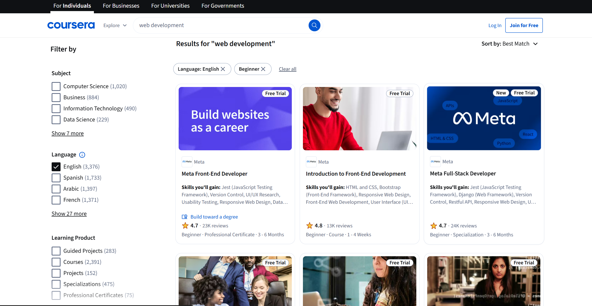

<div align="center">
  <h2 align="center">📚 Coursera Automation Testing Suite</h2>
  <p align="center">
    Automation of Coursera workflows using Selenium WebDriver with Java and TestNG
  </p>
  
  <br />

  <p align="center">
    
    
    
    
    
  </p>
</div>

## 📋 <a name="table">Table of Contents</a>

1. 🤖 [Introduction](#introduction)
2. ⚙️ [Tech Stack](#tech-stack)
3. 🔋 [Features](#features)
4. 🤸 [Quick Start](#quick-start)
5. 📸 [Screenshots](#screenshots)

## <a name="introduction">🤖 Introduction</a>

This project automates test cases on [Coursera](https://www.coursera.org/) using **Selenium WebDriver**, **Java**, and the **Page Object Model (POM)** design pattern. It focuses on:

- Searching for courses and applying filters (language, level).
- Extracting details from search results.
- Navigating to the Enterprise section and filling out forms.
- Validating error messages for incorrect input (like invalid email).

It integrates reporting, logging, and screenshot capture for a robust automation workflow.

---
## <a name="tech-stack">⚙️ Tech Stack</a>

- **Automation Framework:** Selenium WebDriver, TestNG
- **Programming Language:** Java 22
- **Build Tool:** Maven
- **Design Pattern:** Page Object Model (POM)
- **Logging:** Log4j2
- **Reporting:** ExtentReports
- **Data Handling:** Apache POI (Excel)
- **Screenshot Capture:** Base64 Embedding

---

## <a name="features">🔋 Features</a>

👉 **Course Search Automation**
- Search for courses with applied filters (Language, Level).

👉 **Enterprise Form Automation**
- Fill and submit forms with validation for incorrect inputs.

👉 **Screenshot Utility**
- Capture screenshots and embed them in ExtentReports using Base64 encoding.

👉 **Excel Data Integration**
- Fetch test data dynamically from Excel sheets using Apache POI.

👉 **Logging & Reporting**
- Log4j2 for detailed logs.
- ExtentReports for visually appealing HTML test reports.

👉 **Error Handling**
- Graceful handling of exceptions with custom error messages.

---

## <a name="quick-start">🤸 Quick Start</a>

Follow these steps to set up the project locally on your machine.

### Prerequisites

- [Java 22](https://www.oracle.com/java/technologies/javase/jdk22-archive-downloads.html)
- [Maven](https://maven.apache.org/install.html)
- [Git](https://git-scm.com/)
- Browser (Chrome/Edge)

---


### 🚀 Run Locally

Clone the repository:

```bash
git clone https://github.com/Aditya10403/CourseraAutomation_v.1.git
cd CourseraAutomation_v.1
```

### Installation dependencies

Install the project dependencies using mvn:

```bash
mvn clean install
```

### Run the Test Suite

```bash
mvn test
```

The **HTML report** will be generated under the `/reports` directory.

## <a name="screenshots">📸 Screenshots</a>

### ✅ Successful Course Search


### ⚠️ Enterprise Form Error Capture


### 📊 Extent Report View


---

#### Test PASSED


---

#### Test FAILED


---

## <a>🚨 Disclaimer</a>

This automation project was developed as part of my internship at **Cognizant** for learning and demonstration purposes.  
Coursera® is a registered trademark of its respective owners. This repository is not affiliated with or endorsed by Coursera or Cognizant.

